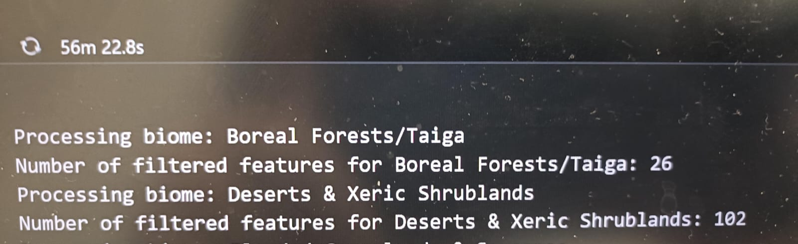

# Individual Reflection

## Table of Contents
1. [Technical Contributions](#technical-contributions)
2. [Team Collaboration](#team-collaboration)
3. [Learning Journey](#learning-journey)

---

# Technical Contributions

## Specific Code/Features Developed
- **Data Collection & Processing**: Developed a Python script (`NB1B.py`) to automate the collection of biome coordinates, ensuring accurate geographical data for analysis. Implemented batch processing to reduce runtime from **1 hour** to **a few minutes** and prevent kernel failures. Optimized the script to collect only central coordinates, reducing data size significantly.  
  **Evidence**:  
  - [Link to `NB1B.py` on GitHub](https://github.com/lse-ds105/ds105a-2024-project-error_105/blob/main/code/data_collection/process_biomes.py)  
  - Code snippets showing batch processing and optimization:  
    ```python
    # Example code snippet
    def process_biome_batch(ecoregions, biome_names, combined_data, batch_num, total_batches):
    """
    Process a batch of biomes and extract centroids for each ecoregion.
    """
    print(f"\n[Batch {batch_num}/{total_batches}] Processing biomes: {', '.join(biome_names)}")

    # Filter the dataset to include only the specified biomes
    selected_biomes = ecoregions.filter(ee.Filter.inList("BIOME_NAME", biome_names))
    ```
  - Reduced time:  
    - Before: 1 hour
    

    - After: 1 minute 

- **Interactive Map Development**: Contributed to the Folium-based interactive map. Added Pokémon markers with pop-ups to visualize biome-weather data and experimented with features like a search bar for better user interaction.  
  
  **Evidence**:  
    - **Screenshots of the map with Pokémon markers and pop-ups:**      
        - Before: [Basic Map](../Reflections/supporting_evidence_hailey/pokemon_map_initial.html)
        - After: [Interactive map with Pokémon markers](../visuals/html_files/pokemon_map.html)
    - **Git Commit History:**

| Commit Hash | Feature Added | Commit Link |
|------------|--------------|-------------|
| `be3f9e6`  | Added Pokémon markers to the map | [View Commit](https://github.com/lse-ds105/ds105a-2024-project-error_105/commit/be3f9e6ac8275b0a0c487d28fcadf39dc58c87e5) |
| `f39a053`  | Added cluster feature | [View Commit](https://github.com/lse-ds105/ds105a-2024-project-error_105/commit/f39a053166c861323228feb025ba72f7aeeb17b9) |
| `010f404`  | Refined code | [View Commit](https://github.com/lse-ds105/ds105a-2024-project-error_105/commit/010f404f2e2de1e3ec6a759bcf55de1c2b3d0915) |


- **Webpage Design**: Designed the 'Findings' section with a clean academic format and refined other sections. Standardized the theme across all pages and incorporated creative components like a Pokémon game on the homepage. Learned and implemented CSS and JavaScript to enhance user experience.  

  **Evidence**:  
  - [Findings Section on the Webpage](https://lse-ds105.github.io/ds105a-2024-project-error_105/visualisations.html)  
  - Website referenced for HTML/CSS/Javascript: [Website 1](https://www.w3schools.com/html/), [Website 2](https://www.w3schools.com/bootstrap5/) 
  - [Github Commit](https://github.com/lse-ds105/ds105a-2024-project-error_105/commit/23c81adc0885b94c739b60c90c32b12221938afc)

## Problems Solved
- Reduced script execution time significantly using batch processing.  
- Prevented excessive data collection, optimizing memory usage and preventing kernel crashes.  
- Ensured consistent and accessible webpage design while maintaining aesthetic appeal. 
- Standardising designs for the webpages to ensure consistency.  

## Technical Decisions Influenced
- Developed a user-friendly Python script for biome data collection, allowing users to run it via terminal commands.  
- Suggested implementing **marker clustering** on the map to improve performance.  
- Recommended a **cohesive theme** for the webpage to ensure better readability and user engagement.  

---

# Team Collaboration

## Role in Team Coordination
- Maintained regular updates via Telegram and online meetings. Clarified doubts and assigned specific tasks to avoid redundancy and improve efficiency. 

  **Evidence**:    


## How I Supported Team Members
- Assisted teammates with debugging Python scripts and optimizing map features.  
- Provided design insights to ensure the webpage adhered to a creative and user-friendly style.  

## Conflict Resolution Examples
- No major conflicts.
- Fostered open communication and ensured all team members were aligned in their goals.  
- Actively listened to everyone’s ideas and offered constructive feedback, creating a supportive environment.    

---

## Learning Journey

### Skills Developed
- **Python:** Improved proficiency in data automation to increase efficiency and Folium-based mapping by using python to generate a HTML file.

- **HTML/CSS & JavaScript:** Gained experience in front-end web development. Through this experience, actually understood the functions of each code and how HTML, CSS and Javascript works together to create a visually appealing website.

- **Good Practices of Coding:** Learnt how to ensure sensitive information was handled securely. Created a service account to interact with external APIs, and stored important credentials in a `.env` file, helping to keep sensitive data secure. 

### Challenges Overcome
- **Time zone differences**: Scheduled flexible meeting times to accommodate all members.
- **Balancing aesthetics with functionality**: Prioritized clarity while maintaining an engaging user experience.

### Areas for Future Growth
- **Developing Stronger Leadership Skills**: Be more confident in guiding members through technical challenges, decision-making, and feature implementation. Setting clear goals and take on a more active role in project coordination.
- **Processing and Visualizing Larger Datasets**: Learning advanced data manipulation techniques, such as parallel processing and use more data visulization tools. Explore distributed computing frameworks like **Dask** or **Apache Spark** to handle large datasets across multiple systems, enabling faster data processing and more effective analysis.
- **Webpage designing**: I can learn more about HTML/CSS/Java to come up with more complicated web designing and incorporate more functions such as making the website usable on all devices instead of just laptop.
---
