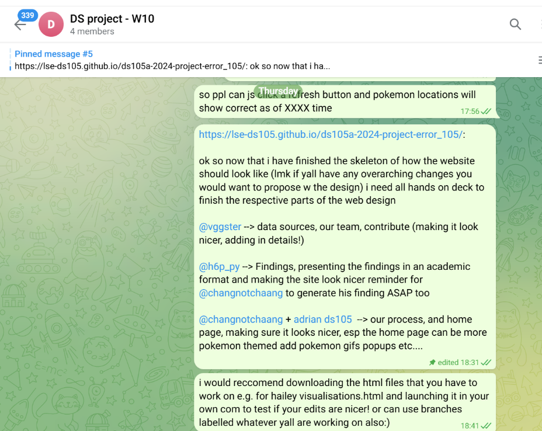
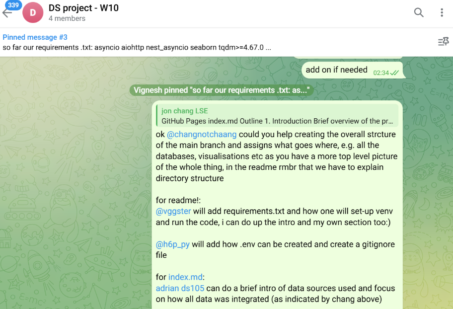

# **Reflection**  
**Vignesh Narayanan**

---

## **Technical Contribution Example** 🔧

One of my primary contributions was designing and implementing a data pipeline to identify the **hottest** and **coldest** regions globally using centroid-based coordinates. This involved integrating **asynchronous API requests** and ranking logic to process temperature data efficiently.

Initially, I experimented with a **batching approach** to group multiple API requests, intending to stay within Open-Meteo’s API rate limits. However, this approach proved problematic due to frequent **rate-limit errors**. I later transitioned to `asyncio`, which provided a non-blocking, asynchronous solution, allowing us to process multiple requests concurrently. A helpful analogy from [Medium](https://medium.com/@vijaygadhave2014/synchronous-asynchronous-and-multithreading-whats-the-difference-4a7e5399c070#:~:text=2.-,Understanding%20Asynchronous%20Programming%20with%20a%20Coffee%20Shop%20Analogy,tasks%20at%20the%20same%20time.) compares `asyncio` to pre-ordering coffee at a café: instead of waiting in line (synchronous requests), you place your order on an app (`asyncio`) while the barista prepares other drinks.

The redesigned pipeline successfully scaled to thousands of coordinates, dynamically handling rate limits and minimising excessive retries. This significantly reduced **execution time** and improved scalability for larger datasets. The table below summarises the methods I tried out, and proof is in the commit below.  
**[GitHub Commit](https://github.com/lse-ds105/ds105a-2024-project-error_105/commit/d432dd0359d4da1738698309a62e062a8888e772)**  

---

| **Method**            | **Description**                                                                                                                        | **Rate Limit Handling**                                       | **Outcome**                                                                                                                                                                                                                     |
|-----------------------|----------------------------------------------------------------------------------------------------------------------------------------|--------------------------------------------------------------|-----------------------------------------------------------------------------------------------------------------------------------------------------------------------------------------|
| **Batching**           | Divided 1500 coordinates into batches of 50 and sequentially processed them. Manual time delays between batches.                       | None                                                         | ❌ Failed due to excessive time and impractical retries.                                                                                                                                   |
| **ThreadPoolExecutor** | Used 50-100 threads to parallelise requests. No explicit rate throttling per thread.                                                  | None                                                         | ❌ Failed as it exceeded rate limits, causing repeated **429 Too Many Requests** errors.                                                                                                       |
| **Asyncio**            | Leveraged `asyncio` and semaphores to limit concurrent requests to 10. Strict adherence to API limits (10 requests/sec).               | Automated                                                    | ✅ Successfully processed 1500+ requests without errors, dramatically improving performance. (Also the most efficient in terms of storage as threads consume more resources!)               |

---

## **Specific Code/Features Developed** 🖥️

### **OpenMeteo Weather Exploration** 🌦️
I reviewed Hailey’s JSON file, flattened it, and converted it into a structured dataframe. This transformation allowed us to create a comprehensive database that included the most extreme locations worldwide and their corresponding weather conditions.

---

### **Interactive Maps with Folium** 🗺️
I explored and documented the use of the **Folium** library to create **interactive maps**. This work enabled the team to visualise geographic data effectively, significantly enhancing the usability and presentation of our project.  

- Example of my work: [Notebook with Map Drafts](../code/data_processing/NB2C%20-%20Weather%20Data%20Processing.ipynb)  
- Final visualisations: [Findings Section on GitHub Webpage](https://lse-ds105.github.io/ds105a-2024-project-error_105/visualisations.html)

---

### **GitHub Website Outline** 🌐
I initiated the **GitHub Webpage** by:  
- Outlining its structure.  
- Setting a clear direction for content organisation.  

To achieve this, I self-learned **HTML** using W3Schools and adapted from this [format](https://www.w3schools.com/w3css/tryit.asp?filename=tryw3css_templates_website&stacked=h). @Hailey-YHL then improved the format further by implementing a cleaner structure she discovered.  
**[My Contribution](https://github.com/lse-ds105/ds105a-2024-project-error_105/commit/bb16faa39980c3595e30056ef806645d8623b7f8)**  

---

### **Pokémon-Specific Logic** 🎮
I developed logic tailored to Pokémon-related analysis by:  
- Laying out how the final product should look.  
- Communicating clear requirements to Adrian and Hailey to ensure successful implementation in the final map.

---

## **Problems You Solved** 💡

### **Technical Challenges**  
- Solved API rate-limit errors by transitioning from **synchronous** and multi-threaded approaches to **asynchronous requests**, which improved scalability and efficiency.  

### **Team Coordination Issues**  
- Unexpected challenges, such as Jon's injury, delayed progress. I stepped up to redistribute tasks and maintain momentum, ensuring deadlines were met.

---

## **Technical Decisions You Influenced** 🎯
- Encouraged the team to use **Folium** for visualisation, which added an **interactive** dimension to the project.  
- Played a key role in setting the scope of the project by recommending a focus on core deliverables, such as **region classification**, **mapping**, and user functions of the map.  
- Proposed workarounds for feasibility concerns. 

---

## **Team Collaboration** 🤝

### **Role in Team Coordination**  
- Organised **weekly team meetings** to ensure progress was on track and created task lists to maintain accountability. I had a vision of what features I expected we should have on the end result and I made sure that was communicated clearly from the start.  
- Additionally, I followed up individually with team members to provide support and ensure they could meet deadlines.  

*Examples*  

|  |  |
| ------------------------------------------------------------ | ------------------------------------------------------------ |

### **Supporting Team Members**  
- When Jon tore his ACL, I had to spend some time taking care of him, as we stay in the same hall (he had to endure my horrendous cooking), and we were sidetracked from our project.  

- Helped less familiar team members understand **Pokémon-related concepts**, ensuring they could contribute effectively.  
- Individually texted team members to ensure they were getting along well with their tasks and offered help when they were stuck.

---

### **Conflict Resolution** ⚖️
- There were no major conflicts, but I took extra care to explain our project’s vision to the team. 
- I also was very ambitious in our end result at times and proposed many features for the end result. In the end, we went with a few that we felt were the most important by evaluating feasibility and researching the effort required for implementation.  

---

## **Learning Journey** 📚

### **Skills Developed**  
- Understanding of how to troubleshoot using a variety of sources. (Not just ChatGPT....)  
- Developed advanced knowledge of data visualisation tools like [Folium](https://python-visualization.github.io/folium/latest/) and [ggplot](https://ggplot2.tidyverse.org/reference/ggplot.html)!  
- Improved **Git proficiency**, transitioning from a beginner to confidently using version control for collaborative coding. (Never making the mistake of pushing my .env again like in week 10!)  

**Main Insight:** How to tackle a coding problem from start to finish in a structured and analytical way (I think that was the purpose of this course, not just the technical know-how).  

---

### **Challenges Overcome** ⏳
- **Time Management:** Balancing ambitious project goals with real-world constraints taught me to prioritise high-impact tasks over perfectionism.  
- **Coding Process:** Initially, I focused too much on the output rather than the process, which led to inefficiencies (and sometimes an overreliance on LLMs). I now emphasise using markdown and structured comments to document frameworks to ensure I understand the principle behind any given solution.  

---

### **Areas for Future Growth** 🌱
- **Code Organisation:** I aim to improve by planning coding frameworks more carefully before implementation, for a more streamlined approach.  
- **Advanced Visualisation:** I intend to explore advanced features of **Folium** and other visualisation tools to enhance storytelling with data. I also hope to use tools like **Streamlit** to make the webpage clearer and more interactive in the future!  
- **Cross-Disciplinary Insights:** I plan to deepen my understanding of interdisciplinary methods that integrate domain-specific knowledge with data science techniques (e.g., regression in machine learning, etc.).  

---

### Word Count: **733** ✍️