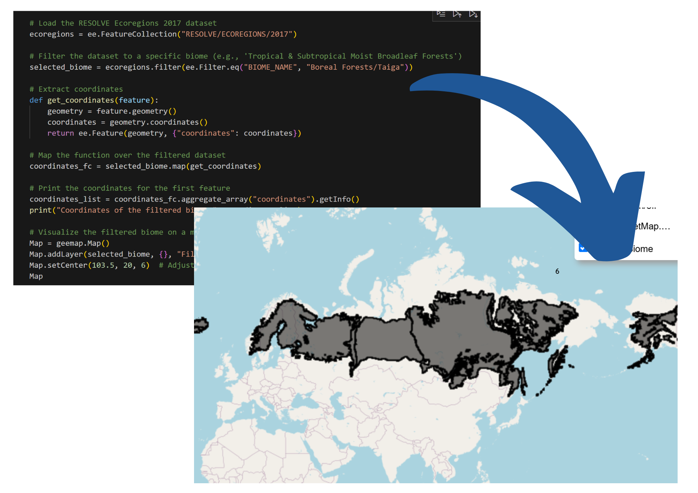
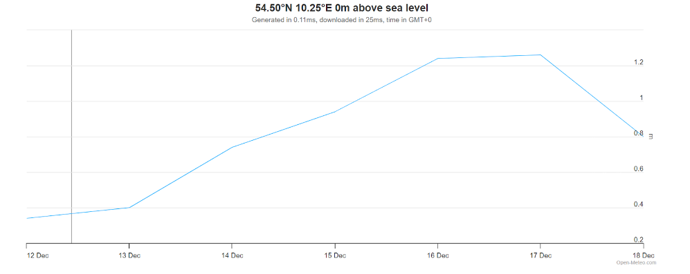

# Project Error_105

# Step 2

# Step 3
### Pokémon Types, Biomes, and Justifications

| **Type**      | **Primary Biomes**                       | **Notes/Justification**                                     |
|---------------|------------------------------------------|-------------------------------------------------------------|
| **Fire**      | Hot areas, deserts, volcanic regions     | High temperatures                                           |
| **Water**     | Areas with significant rainfall, lakes, or oceans | Match to precipitation and water coverage                 |
| **Electric**  | Cities with frequent lightning, high thunderstorm rates | Possible use of a lightning API for mapping            |
| **Grass**     | Grasslands, jungles (scaled by density)  | Use vegetation density as a metric                          |
| **Ice**       | Tundra, polar regions                    | Match to cold temperature regions                           |
| **Fighting**  | Cities with high crime or violence rates | Use socio-economic crime datasets                           |
| **Poison**    | Jungles, regions with low air quality    | Match to pollution or toxic zones                           |
| **Ground**    | Caves, arid lands                        | Focus on subsurface and dry areas                           |
| **Flying**    | Mountain peaks                           | Match to high-elevation coordinates                         |
| **Psychic**   | TBD                                      | Suggestions: Isolated regions, areas of peace               |
| **Bug**       | Grasslands, jungles (scaled by density)  | Overlap with Grass biomes                                   |
| **Rock**      | Mountain range bases                     | Match to rocky low-elevation zones                          |
| **Ghost**     | Swamps, mangroves                        | Associated with mysterious, dark environments               |
| **Dragon**    | TBD                                      | Rare biomes like ancient forests                            |

---

### Example Analysis

- **Pikachu (Electric)**: Would stay in high-rainfall, high-lightning regions based on environmental data.
---

### Insight into Analysis of a Specific Type

- **Water-Type Pokémon**:
  - Can be classified into two main biomes: **lakes** and **oceans**.
  - For oceans, use marine forecast data: [Open-Meteo Marine Weather API](https://open-meteo.com/en/docs/marine-weather-api).
  - Use metrics like **wave height max** to indicate how strong specific parts of the ocean are.
  - Compile Pokémon stats and scale them by strength based on these metrics.

---
  

### Handling Dual-Typed Pokémon

- Many Pokémon are dual-typed.  
- **Plan**:
  - Manually allocate dual-typed Pokémon to their predominant type.
  - Use PokéAPI to identify the main type for feasibility.  
  - This is manageable because the analysis focuses only on Generation 1 Pokémon.

# Step 4

### Limitations and how to mitigate them

