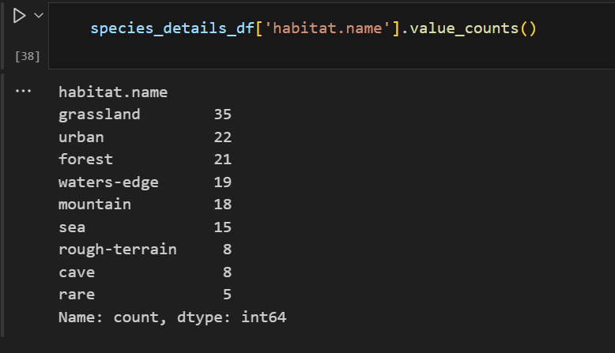
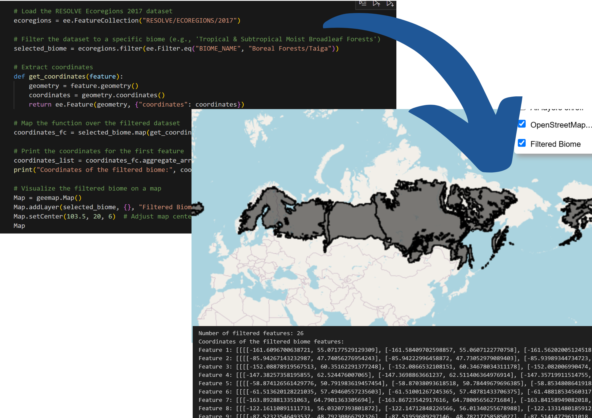

# Team Error_105
# **Where would Pokémon stay in the Real World?**  
<div align="center">
  
</div>


---

## **Goals**
- Allocate Pokémon to biomes and habitats based on their types, traits, and power scales.
- Use APIs and datasets to map these biomes to real-world locations, incorporating environmental and ecological data.
- Visualize the results on an interactive map with Pokémon-specific details (e.g., have a global view of where Pokémon will exist, maybe using Folium or GeoPandas).
- **Ambitious Extension**: Enable Pokémon search by name with satellite imaging of their habitats (using NASA API).

---

## **Outline**

### **1. Introduction** 
- Overview of the project and its objectives.

### **2. Steps**

#### **Step 1: Allocate Pokémon Types to Biomes**  
- Assign Pokémon to specific biomes based on their characteristics and environmental traits.
*(Lead: Jonathan)*  

#### **Step 2: Identify Real-World Biomes**  
- Locate real-world regions corresponding to these biomes and provide geographic coordinates for each biome.  
  *(Lead: Hailey)*  

#### **Step 3: Assign Pokémon by Power Scaling**  
- Rank Pokémon within their respective biomes based on power scaling.  
- Example:  
  - Stronger Pokémon (e.g., Charizard) inhabit the most extreme parts of their biome (e.g., the hottest deserts).  
  - Weaker Pokémon (e.g., Charmander) stay in less extreme areas.  
  *(Lead: Vignesh)*  

#### **Step 4: Rank Real-World Biomes by Strength**  
- Evaluate real-world locations based on their "biome strength."  
- Example: The Lut Desert, the hottest desert globally, would be rated 100.
*(Lead: Adrian)* 

#### **Step 5: Allocate Pokémon to Precise Global Locations**  
- Using the scaling criteria, assign Pokémon to specific real-world coordinates on a global map.  

---

### **Final Deliverables**
- A fully interactive map showcasing Pokémon distribution by biome.
- Integration of additional tools and APIs (e.g., Open-Meteo, NASA APIs) for enhanced visualization and analysis.

---
# Step 1 
### **The `PokeApi`** 
Our goal is to categorise all Generation 1 Pokemon based on their habitats, types, and base stats. To do this, we’ll use three main endpoints from PokéAPI: Generation, Pokemon, and Pokemon Species. We will achieve this in three steps:

1. We’ll use the Generation endpoint to fetch all the Pokemon in Generation 1. This will give us a list of PokemonIDs that we’ll use to pull more detailed data in the next steps.
2. For each Pokemon ID, we’ll use the Pokemon endpoint to get two key pieces of information: their types, like Grass, Fire, or Water, and their base stats, which include things like HP, Attack, and Defense. These stats will help us determine the overall "strength" of each Pokemon. This will be done in Step 3. 
3. After that, we’ll use the Pokemon Species endpoint to find out where each Pokemon lives in the game. Here’s the full list of possible habitats and how many Pokemon live in each habitat in Generation 1: 



With this information, we’ll know where each Pokemon is typically found.

---

# Step 2
### **A world map classified by biomes:**


### **A map that highlights locations with the chosen biome along with the corresponding coordinates:**


---

**Problem:** Each type of biomes have so many locations, how do we filter them further to find the **BEST** location for the Pokemons?  
**Plan:** We can use other APIs (eg. OpenMeteo) to further analyse more specific places that are suitable for the different Pokemon characters.

---


# Step 3
### Pokémon Types, Biomes, and Justifications

| **Type**      | **Primary Biomes**                       | **Notes/Justification**                                     |
|---------------|------------------------------------------|-------------------------------------------------------------|
| **Fire**      | Hot areas, deserts, volcanic regions     | High temperatures                                           |
| **Water**     | Areas with significant rainfall, lakes, or oceans | Match to precipitation and water coverage                 |
| **Electric**  | Cities with frequent lightning, high thunderstorm rates | Possible use of a lightning API for mapping            |
| **Grass**     | Grasslands, jungles (scaled by density)  | Use vegetation density as a metric                          |
| **Ice**       | Tundra, polar regions                    | Match to cold temperature regions                           |
| **Fighting**  | Cities with high crime or violence rates | Use socio-economic crime datasets                           |
| **Poison**    | Jungles, regions with low air quality    | Match to pollution or toxic zones                           |
| **Ground**    | Caves, arid lands                        | Focus on subsurface and dry areas                           |
| **Flying**    | Mountain peaks                           | Match to high-elevation coordinates                         |
| **Psychic**   | TBD                                      | Suggestions: Isolated regions, areas of peace               |
| **Bug**       | Grasslands, jungles (scaled by density)  | Overlap with Grass biomes                                   |
| **Rock**      | Mountain range bases                     | Match to rocky low-elevation zones                          |
| **Ghost**     | Swamps, mangroves                        | Associated with mysterious, dark environments               |
| **Dragon**    | TBD                                      | Rare biomes like ancient forests                            |

---

### Example Analysis

- **Pikachu (Electric)**: Would stay in high-rainfall, high-lightning regions based on environmental data.
---

### Insight into Analysis of a Specific Type

- **Water-Type Pokémon**:
  - Can be classified into two main biomes: **lakes** and **oceans**.
  - For oceans, use marine forecast data: [Open-Meteo Marine Weather API](https://open-meteo.com/en/docs/marine-weather-api).
  - Use metrics like **wave height max** to indicate how strong specific parts of the ocean are.
  - Compile Pokémon stats and scale them by strength based on these metrics.

---
  


# **Example of Code**

```python
def assign_locations(pokemon_row, locations_df):
    # Filter locations by the Pokémon's biome and sort by condition scale (which we will define for each type).
    filtered_locations = locations_df[locations_df['Biome'] == pokemon_row['Biome']].sort_values(by='ConditionScale', ascending=False)
    
    # Assign the location matching the Pokémon's power scale (through compiling overall stats of Pokémon).
    match = filtered_locations[filtered_locations['ConditionScale'] == pokemon_row['PowerScale']]
    if not match.empty:
        return match.iloc[0][['Latitude', 'Longitude']]
    else:
        return filtered_locations.iloc[-1][['Latitude', 'Longitude']]

# Apply location assignment
pokemon_ranked[['Latitude', 'Longitude']] = pokemon_ranked.apply(
    lambda row: assign_locations(row, locations),
    axis=1,
    result_type='expand'
)

# Convert to GeoDataFrame for visualization
pokemon_ranked['geometry'] = pokemon_ranked.apply(lambda row: Point(row['Longitude'], row['Latitude']), axis=1)
pokemon_gdf = gpd.GeoDataFrame(pokemon_ranked, geometry='geometry')
```

### Handling Dual-Typed Pokémon

- Many Pokémon are dual-typed.  
- **Plan**:
  - Manually allocate dual-typed Pokémon to their predominant type.
  - Use PokéAPI to identify the main type for feasibility.  
  - This is manageable because the analysis focuses only on Generation 1 Pokémon.


# Step 4

<iframe width="560" height="315" src="https://www.youtube.com/embed/_smhC4uv7Tw" title="YouTube video player" frameborder="0" allow="accelerometer; autoplay; clipboard-write; encrypted-media; gyroscope; picture-in-picture; web-share" allowfullscreen></iframe>


### Limitations and how to mitigate them


### For more detailed information on our data sources, check out: [Datasets and Their Uses](datasets-and-their-uses.md)

### Here is how we plan to split the work:
                                                  
| Week     | Tasks                                                                                                  | Assigned To                                                                                          | Notes                             |
|----------|--------------------------------------------------------------------------------------------------------|------------------------------------------------------------------------------------------------------|-----------------------------------|
| Week 1   | Preliminary Research: Finalize data sources and research Pokémon-biome matching logic.                  | Adrian (data sources), Vignesh (Pokémon-biome logic), Jon (data source review), Hailey (research and organization) | Group check-in at the end of Week 1. |
| Week 2-4 | Process geographic and environmental data. Implement biome-Pokémon mapping.                            | Jon (geographic data), Hailey (environmental data, mapping), Adrian (support), Vignesh (biome-Pokémon mapping) | Group check-in at the end of Week 4. |
| Week 5-7 | Develop ranking system. Integrate Open-Meteo data for power scaling.                                   | Vignesh (ranking system), Adrian (Open-Meteo integration), Jon (support), Hailey (Open-Meteo analysis) | Group check-in at the end of Week 7. |
| Week 8-9 | Visualize Pokémon distribution using GeoPandas and finalize the presentation.                           | Hailey (visualization), Jon (presentation finalization), Vignesh (presentation finalization), Adrian (final adjustments) | Group check-in at the end of Week 9. |


### Additional Notes:
- The group will check in once every **two weeks** to ensure everything is on track, discuss progress, and address any potential issues.
- Tasks are distributed evenly but can be adjusted based on team availability and specific strengths.


### Why must you be careful around pokemon? Cos they might just peek-a-chu!


---
title: PokéMap Project
---

<!-- Begin Modal Styles -->
<style>
  /* Modal Background */
  .modal {
    display: none; /* Hidden by default */
    position: fixed;
    z-index: 1000;
    left: 0;
    top: 0;
    width: 100%;
    height: 100%;
    overflow: auto;
    background-color: rgba(0,0,0,0.4);
  }
  /* Modal Content */
  .modal-content {
    background-color: #fff;
    margin: 10% auto;
    padding: 20px;
    border: 1px solid #888;
    width: 80%;
    position: relative;
    box-shadow: 0 5px 15px rgba(0,0,0,0.3);
  }
  /* Close Button */
  .close {
    color: #aaa;
    position: absolute;
    right: 10px;
    top: 5px;
    font-size: 28px;
    font-weight: bold;
    cursor: pointer;
  }
  .close:hover,
  .close:focus {
    color: black;
    text-decoration: none;
  }
  /* Basic button style */
  button {
    padding: 8px 16px;
    font-size: 14px;
    margin-top: 10px;
    cursor: pointer;
  }
</style>
<!-- End Modal Styles -->

# PokéMap Project

## 1. Introduction

Welcome to the **PokéMap Project**! This initiative maps Pokémon of specific types—fire, water, and ice—based on real-world environmental data. By integrating Pokémon characteristics with geographic and weather data, we create an immersive visualization of where Pokémon would most likely reside in the real world.

### Purpose of the Project
- Combine Pokémon traits and environmental data to simulate realistic Pokémon habitats.
- Provide a fun and data-driven visualization tool for Pokémon fans and researchers.

### Data Sources Used
Click on each source below to learn more:

- **PokeAPI**  
  <button onclick="openModal('modal-pokeapi')">Learn More</button>
  
- **Open-Meteo API**  
  <button onclick="openModal('modal-openmeteo')">Learn More</button>
  
- **Google Earth Engine Dataset**  
  <button onclick="openModal('modal-googleearth')">Learn More</button>

---

## 2. Our Process

### Pokémon Data Analysis
1. **Ranking Pokémon**  
   Pokémon were ranked on a scale of 1-100 based on their affinity for heat, cold, or wet conditions.
   - Fire Pokémon (e.g., Charizard) ranked high for heat.
   - Ice Pokémon (e.g., Articuno) ranked high for cold.
   - Water Pokémon (e.g., Blastoise) ranked high for wet conditions.
2. **Matching Pokémon to Locations**  
   - Fire Pokémon matched with the top 100 hottest places globally.
   - Ice Pokémon matched with the top 100 coldest places.
   - Water Pokémon matched with the top 100 wettest places.

### Biome Data Analysis
1. **Data Extraction**  
   Biome classifications were extracted from the Google Earth Engine dataset.
2. **Location Refinement**  
   Biome data helped filter out unsuitable matches (e.g., avoiding aquatic biomes for fire Pokémon).

### Weather Data Analysis
1. **Using the Open-Meteo API**  
   Historical and forecasted weather data were retrieved to identify extreme weather regions.
2. **Processing and Matching**  
   Extreme weather regions were matched with Pokémon ranking scores.

### Integration of All Data
- **Combining Data**: Integrated Pokémon, biome, and weather data using Python scripts.
- **Mapping with Folium**: Created interactive maps showing the top 100 locations for each Pokémon type.

---

## 3. Final Findings

### Map Representation
An interactive map created with Folium displays:
- Markers for the top 100 locations for fire, water, and ice Pokémon.
- Overlays for biome classifications and weather trends.

### Conclusion
The PokéMap project demonstrates how multiple datasets can be integrated to simulate realistic Pokémon habitats. It’s both a fun tool for fans and an innovative application of data science.

---

<!-- Begin Modal HTML -->

<!-- Modal for PokeAPI -->
<div id="modal-pokeapi" class="modal">
  <div class="modal-content">
    <span class="close" onclick="closeModal('modal-pokeapi')">&times;</span>
    <h3>PokeAPI</h3>
    <p>
      PokeAPI provides detailed information about Pokémon, including types, stats, and descriptions.
      This data was used to determine Pokémon affinities for specific environmental conditions.
    </p>
  </div>
</div>

<!-- Modal for Open-Meteo API -->
<div id="modal-openmeteo" class="modal">
  <div class="modal-content">
    <span class="close" onclick="closeModal('modal-openmeteo')">&times;</span>
    <h3>Open-Meteo API</h3>
    <p>
      The Open-Meteo API was used to retrieve historical and forecasted weather data,
      helping identify the hottest, coldest, and wettest regions in the world.
    </p>
  </div>
</div>

<!-- Modal for Google Earth Engine Dataset -->
<div id="modal-googleearth" class="modal">
  <div class="modal-content">
    <span class="close" onclick="closeModal('modal-googleearth')">&times;</span>
    <h3>Google Earth Engine Dataset</h3>
    <p>
      The Google Earth Engine Dataset provides global biome data, including vegetation,
      terrain, and habitat classifications, which refined our Pokémon location matches.
    </p>
  </div>
</div>

<!-- End Modal HTML -->

<!-- Begin Modal Scripts -->
<script>
  // Open modal function
  function openModal(id) {
    document.getElementById(id).style.display = "block";
  }

  // Close modal function
  function closeModal(id) {
    document.getElementById(id).style.display = "none";
  }

  // Close modal if user clicks outside of modal content
  window.onclick = function(event) {
    const modals = document.getElementsByClassName("modal");
    for (let i = 0; i < modals.length; i++) {
      if (event.target == modals[i]) {
        modals[i].style.display = "none";
      }
    }
  }
</script>
<!-- End Modal Scripts -->

