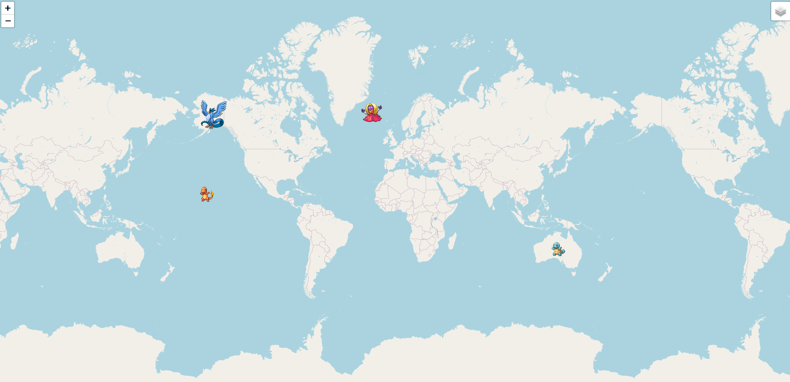
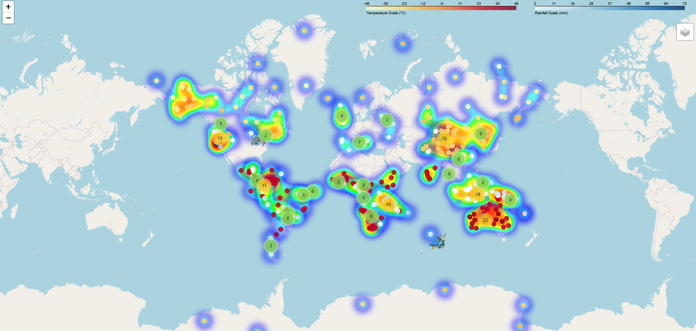
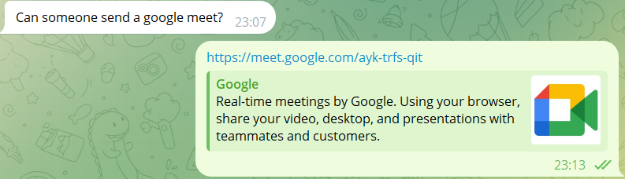

# Individual Reflection

## Table of Contents
1. [Technical Contributions](#technical-contributions)
2. [Team Collaboration](#team-collaboration)
3. [Learning Journey](#learning-journey)

---

# Technical Contributions

## Specific Code/Features Developed
- **Data Visualisation**: Main contributor to the initial iterations of the interactive map. Implemented Vignesh' heatmap overlay, created code to show Pokemon as icons appearing on the map. Identiifed issues with typos appearing in API; fixed them using rudimentary autocorrect before replacing it with a more rigorous method.
  

  **Evidence**:  
  
  - [Link to feature branch of first iteration of map on GitHub](https://github.com/lse-ds105/ds105a-2024-project-error_105/tree/WorldMap)
  - [Link to feature branch of second iteration of map on GitHub](https://github.com/lse-ds105/ds105a-2024-project-error_105/tree/Data_Visualisation)

  
  - Map progression
    
    

   

- **Search Bar Feature**: Used a GeoJson object containing all Pokemon locations and names to implement a search bar that identified and indicated where the searched Pokemon was with a flashing red dot. Encountered difficulties due to numerous bugs with the Search plugin; found workarounds for all but one.
  
  **Evidence**:  
  - [Link to `NB3B - Map.py` on GitHub](https://github.com/lse-ds105/ds105a-2024-project-error_105/blob/main/code/data_collection/process_biomes.py)  
  - [Link to Search Bar feature branch on GitHub](https://github.com/lse-ds105/ds105a-2024-project-error_105/blob/main/code/data_collection/process_biomes.py)  

  - Code snippet from search bar section; needed to transform original data into data format due to bug in the plugin:  
    ```python
    geojson_data = {
    "type": "FeatureCollection",
    "features": []
    }
    # Transform the original data into GeoJson data format
    for item in pokemon_features:
    feature = {
        "type": "Feature",
        "geometry": {
            "type": "Point",
            "coordinates": item['geometry']['coordinates']
        },
        "properties": {
            "name": item['properties']['name']
        }
    }
    geojson_data["features"].append(feature)
    ```


- **Webpage Design**: Designed the 'Data Sources' section. Included descriptions of how we used each source along with API keys and limitations.

  **Evidence**:  
  - [Sources page](https://lse-ds105.github.io/ds105a-2024-project-error_105/sources.html)  
  - [Link to commit](https://github.com/lse-ds105/ds105a-2024-project-error_105/commit/7d88c92df0db0963d89a87643417cbe08627a773)  


## Problems Solved
- **Debugging**: Found workaround to a Folium's Search plugin bug by reshaping data structure, leading to GeoJson layer no longer automatically showing up as a tile layer
- **Layering**: Initially encountered issue that layers integral to map features but unwanted aesthetically would show up with no option to turn them off if both "Control" and "Show" were set to False. Through many hours of tinkering, found the reason behind this issue and resolved it.


## Technical Decisions Influenced
- Map design decisions such as using Icons in place of names, and the heatmap overlay
- Introduction of search bar and other map aesthetics such as heatmap scale
---

# Team Collaboration

## Role in Team Coordination
- Scheduled meetings, and helped with the assignation of tasks

  **Evidence**:


## How I Supported Team Members
- Assisted teammates with tasks, helping them realise the vision of the map
- Gave support in individual cases concerning new features

## Conflict Resolution Examples
- Our team worked smoothly across these weeks.

---

## Learning Journey

### Skills Developed

- **Coding Conventions:** Developed correct coding conventions, particularly regarding annotation and using Markdown to explicate what my code is doing.

- **Python:** Developed skills regarding transforming data structures and wider data analysis, and learnt how to create interactive maps with Folium.

- **HTML/CSS & JavaScript:** Developed JavaScript skills due to bug with search bar, trying to inject Javascript into the map HTML to manually disable a layer that was not aestheticallly pleasing (although ultimately unsuccessful). Also honed HTML and website design skills in the creation of a webpage.


### Challenges Overcome
- **Working across timezones and in difficult circumstances**: Pulled through as a team working across timezones and through a team member's injury


### Areas for Future Growth
- **Leadership**: Develop better leadership skills in guiding team members through technical challenges, decision-making, and feature implementation. In the future, try to set clear goals and step up in project coordination to drive progress.
- **Natural Language Processing Toolkit** Initially wanted use this to classify Pokemon, but abandoned due to unfamiliarity. Would like to advance my skill in this area.
- **General Ability** My teammates were considerably more capable than I was and this drove me to improve as a data scientist and coder.
---
