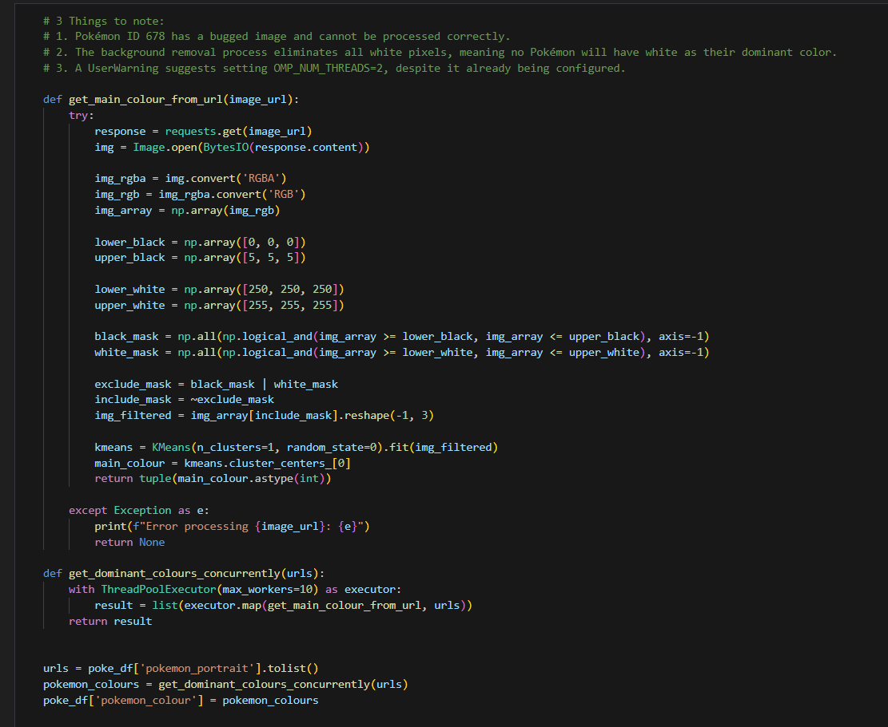
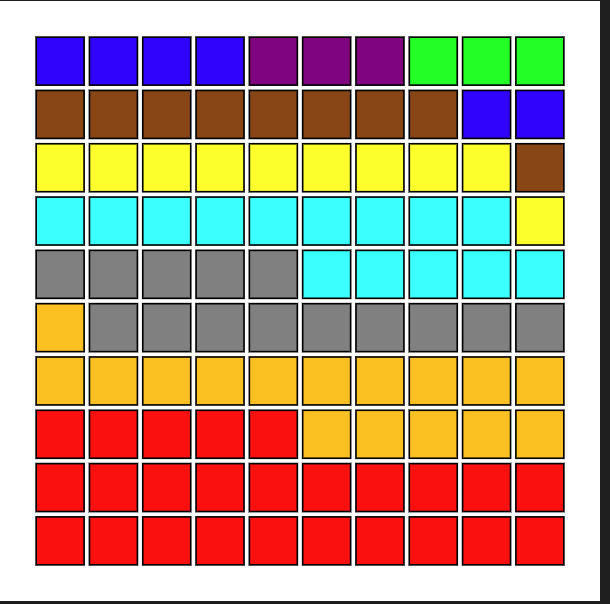
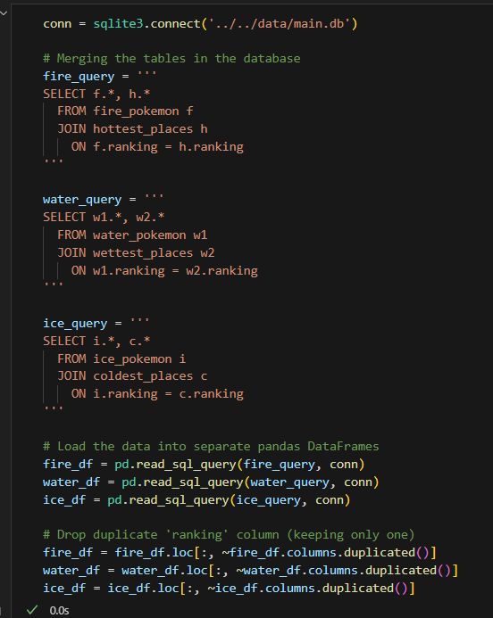
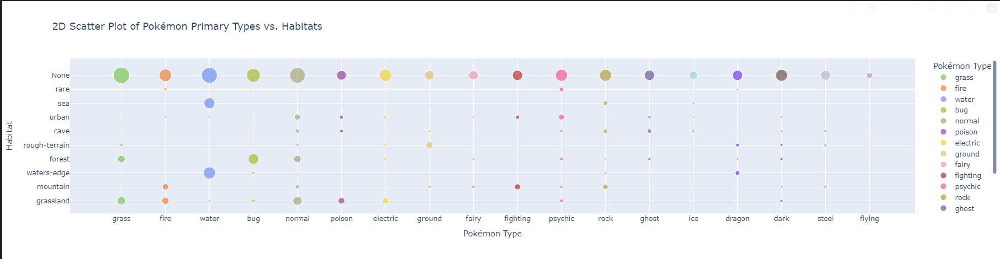
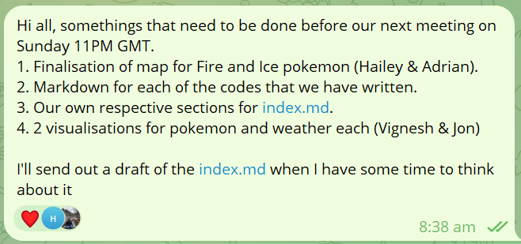
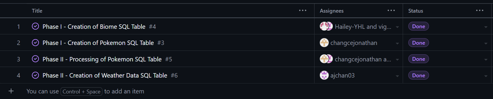
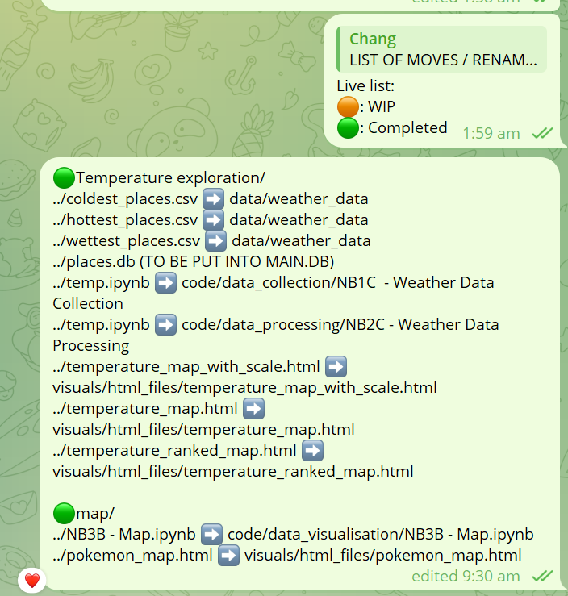

# Individual Reflection - changcejonathan

## Table of Contents
1. [Technical Contributions](#technical-contributions)  
2. [Team Collaboration](#team-collaboration)  
3. [Learning Journey](#learning-journey)  

## Technical Contributions  

### Specific Code/Features Developed  

My main role in this project was to deal with everything Pokémon related. As such, I was responsible for developing the code to collect Pokémon data, process it, and create the rankings to be used for integration. While I was processing the code, I also developed a new code using SciKit's KMeans to identify the dominant colour of the Pokémon. 

  

Furthermore, I created visualisations to portray the trends and patterns that I encountered along the way. 

  

I also suggested the usage of SQL's `JOIN` function, allowing us to seamlessly link Pokémon to locations based on the ranking.

Lastly, I designed the structure and content of the `process` page, as well as the Pokémon segment of the `findings` page, before Hailey added the aesthetic web design. 

### Problems I solved

#### Large Collection Space Required  
While storing the data, I realised that there were various types of data being collected that were not necessary, including many keys in the `json` file with the word `'sprites'`. As such, I kept what was needed and removed the rest to reduce the storage space required.  

#### Partially Resolved Issue of Colour Identification  
When I first created the colour identification code, a problem was encountered where I received the RGB code for White, `(255, 255, 255)`, for all Pokémon. To fix this, I implemented a code to remove the white background before identifying the dominant colour. However, this caused a separate issue of removing all white pixels, which I did not manage to resolve.  

### Technical Decisions I Influenced  

Our group had originally planned to factor the Pokémon's listed habitat on PokéAPI into the placement of Pokémon on the interactive map. However, during my exploratory data analysis, I discovered that the PokéAPI had not stored this data for a significant number of Pokémon. As such, we adopted a simpler approach for matching Pokémon to biomes, eliminating the need to rely on habitat data.  

## Team Collaboration  

### Role in Team Coordination  

As the idea for this project was originally mine, I took more initiative during the initial stages of the project, deciding how the group proposal projects—and the parts we were in charge of—were divided up. However, due to an injury I suffered during the winter break and the medical treatment I underwent afterward, I took a more backseat approach at the start of this year. That said, I remained responsive and contributed my input where I could.

### Supporting Team Members  
The first way I supported team members was by providing input in the overall process. Since the idea was originally mine, I was the first to have a clear understanding of how the project should proceed. As such, I initially guided the team by providing input on how we should move forward. In the early stages, I attempted to do this by engaging GitHub's project board page. 

However, we eventually shifted most of our coordination and collaboration to Telegram, where we could respond and resolve any confusions more efficiently. The second way I supported team members was by helping to neatly organize our repository. This involved restructuring the files, as we had not initially followed a strict structure. This experience taught me the importance of establishing a standard procedure for creating and naming files from the beginning to ensure smooth and efficient project progress.  

### Conflict Resolution
There were no major conflicts, and any simple misunderstandings or miscommunications were resolved during our regular meetings. 

## Learning Journey  

### Skills Developed  
1. **Basic usage of `KMeans` clustering** - for colour allocation
2. **Usage of `ThreadPoolExecutor`** - for faster collection of data
3. **Usage of `PIL` and `matplotlib.colors` for handling colors** - for processing images and sorting colours

### Challenges Overcome  
1. **Time zone differences** – While recovering from surgery in Singapore, I had to coordinate with my teammates across different time zones, requiring us to schedule virtual meetings to stay updated.  
2. **Complex JSON file structure** – The data collected from the PokéAPI was deeply nested and had missing values, requiring me to thoroughly examine the structure to resolve these issues.  

### Areas for Future Growth  
This project has highlighted three areas I want to focus on after DS105A concludes:  
1. Becoming more proficient in HTML and web design  
2. Improving collaboration and familiarity with GitHub's built-in features  
3. Exploring more functionalities within the SciKit library  
